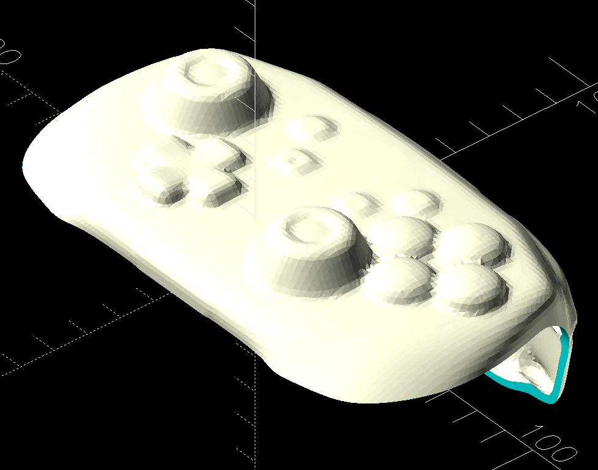
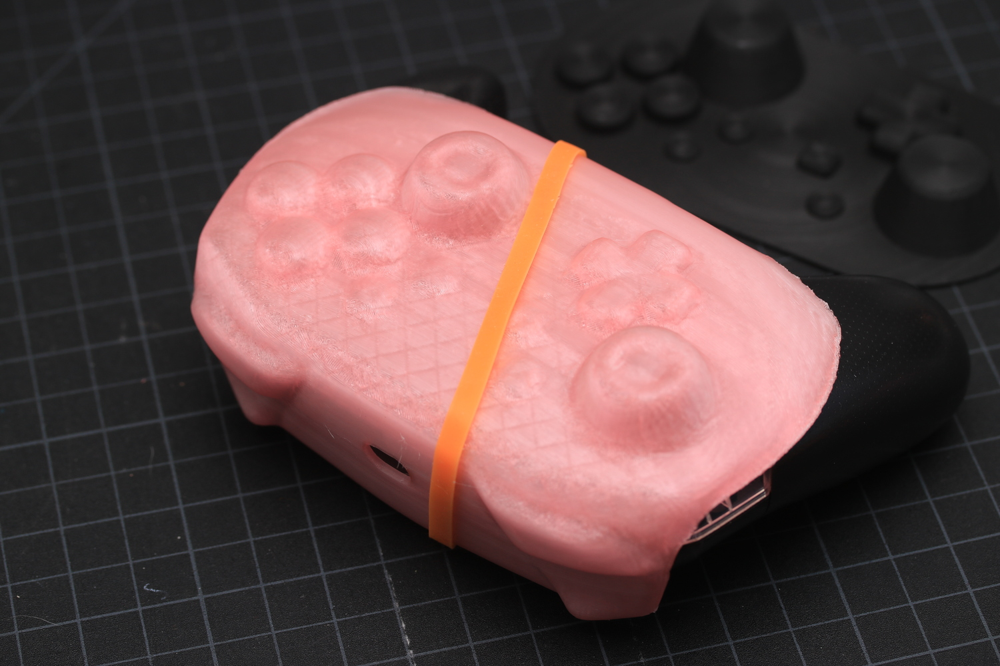

Example of how to use the [sdf](https://github.com/fogleman/sdf) library to apply dilation to an arbitrary mesh, loaded from an STL file. The SDF readme has some instructions for this (building the OpenVDB dependency), but I'm a dummy and I'm bad at building C code, so I found a way to use OpenVDB without building (on linux).

# Setup
`make setup`
- installs [micromamba](https://mamba.readthedocs.io/en/latest/user_guide/micromamba.html)
- installs [openvdb](https://www.openvdb.org/documentation/doxygen/python.html) and sdf to the micromamba environment
- patches one import in `sdf`


# Run
## SDF script
Either `make run` to see if it works, or:

```shell
eval "$(./bin/micromamba shell hook --shell=bash)"
micromamba activate sdf
```

Then `python generate-stl-shell.py`, or create and run other python files, without needing to add new Makefile targets

## OpenSCAD
Render and export `procon-top-shell.scad`

# Example

Nintendo Switch Pro Controller shell cover





## Full process
1. Create or find a base model ([example](https://sketchfab.com/3d-models/switch-pro-controller-5e09103601b04f469ca6dbe5cfde00d9))
2. Correct any issues with the mesh
  - Use Blender to manually remove/reconnect vertices
  - Use Blender to decimate down to manageable mesh size
3. Run SDF script to generate shell. Alternatively, generate multiple STLs at varying surface offset values, to be `difference`d in OpenSCAD
4. Run OpenSCAD script to programatically sculpt the top-only shell shape.